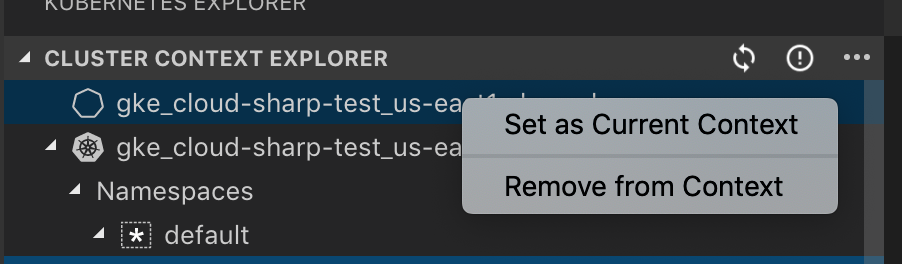

# Kubernetes Explorer

### Clusters

Set as Active Cluster - Enable you too easily interact with them in the Kubernetes explorer.

Open Dashboard - Open the kubernetes dashboard for that cluster.

### Deployments

Add Secret as Environment Variable - Add an existing Kubernetes (secret)[https://kubernetes.io/docs/concepts/configuration/secret/] to the deployment as an environment variable.

TODO: picture

Mount Secret as Volume - Mount an existing Kubernetes (secret)[https://kubernetes.io/docs/concepts/configuration/secret/] as a volume in the deployment's container.

TODO: picture

### Pods

Stream Logs - Stream logs from a pod. If there are multiple containers in the pod, you will be asked to select one.

TODO: picture

View Logs - View logs from a pod. If there are multiple containers in the pod, you will be asked to select one.

TODO: picture

### Containers

Stream Logs - Same as above

View Logs - Same as above

Get Terminal - Open an interactive terminal to the container.

TODO: picture

### Services

For `External IP` object, you can click on a button to open the address in a web browser.

TODO: picture

### Secrets

Clicking on secret object will display the decoded secret as a file.
