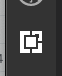
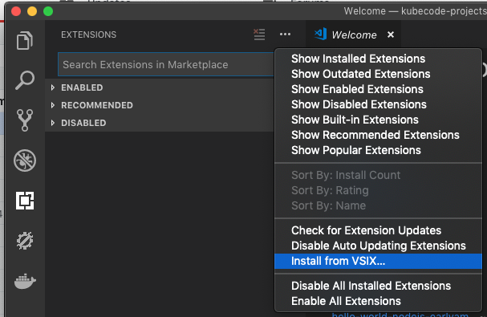
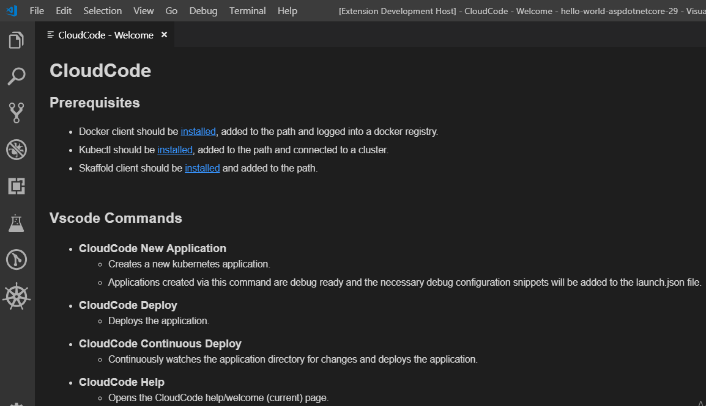

# Kube Code - Start Here

This doc will be shorted over time but it's the 'set-up' and pre-req doc.  Our best experience today will be for:

1. Node
2. Go
3. Python
4. Java

In that order as VS Code itself is best for those.

# Hard Pre-reqs

You won't get far without these - we can help but these will be base assumptions...

- VS Code installed and set-up for your OS e.g. on PATH
- Language support installed and configured for VS code i.e. Go, Node, Python or Java
- Basic knowledge of VS Code and K8's we are not attempting to cover that

# Installing the extensions
> End users will not have to do this.  This is required as we have not released the extensions yet.  We have also not finalized naming or structure.

download these two extensions:
1.
2.

From within VS Code's extension view:

Click install from VSIX and browse to the extensions on your disk.  Install each separately and then reload VS Code.

# GCP Pre-reqs

- An account
- Billing enabled
- Kubernettes enabled

## Welcome Experience

This is the leap off point for several of the getting started and update features.  

Specifically:
- New Project
- Start from sample
- Add additional cloud support
- Jump to docs
- File an issue
- See whats new

> TODO: Missing content and code...
