# KubeCode Feature Tour

> The tools you need for Cloud Native development leveraging your favorite OS, language and cloud.

**Have you ensured your [environment is configured](1_startHere.md) if not do that first.**

This guide is designed to highlight and core features in KubeCode.  Each section has additional supporting docs linked and there is a catch-all section for cool features not sufficiently covered elsewhere.

In many ways the whole goal of KubeCode is to let you focus on your code versus needing to loose context and drop to a CLI, portal or some other tool for very common tasks.  As a result we have worked hard to ensure you can work like you normally would in VS Code.

## Create a Cluster

We provide integrated support to create clusters in GKE, AWS, Azure and MiniKube.  Questions will vary by cluster provider, in this case we will use GKE and we must provide:

- Project ID - you can search to refine the list or `project Ids`
- Zone/Region - we provide an of relevant `zone/region` options this
- Configuration - you name the `cluster`, and provide the `agent type`

Creation time will vary depending on the cluster hoster - for GKE you should expect this to take ~2 minutes.

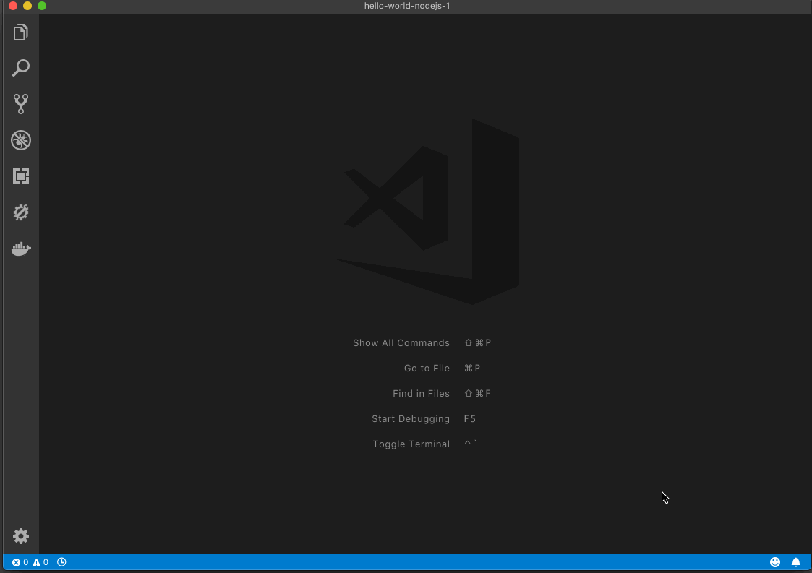

> **Tip:** You can find this command via the `pen` icon in the GKE Explorer.  
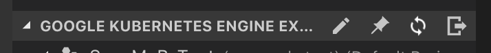

## Create an Application

We have the ability to create a new project for you in your language of choice.  This is a great place to start for simple demos and for this feature tour:

- Open the command pallette 
- Select `KubeCode: New Application`
- Select the language of your choice
- Accept of change the default location

We will then generate a sample application that will allow you to test many of our features.

For more details on what we create and additional options review the [New Application documentation](8_newApplication.md).

> **NOTE:** we will add this to the currently opened workspace - however we suggest you close VS Code and re-open VS code in the new location - ignore the warning about saving the workspace.

## Deploy for the First Time

Under the covers we leverage `Skaffold` - this means that as you edit we automatically re-build and re-package your code and deploy it to a cluster.

The first step is to execute the `KubeCode: Deploy` command - this will build your containers, push them to the registry, apply cluster configs and then return you the IP address you can use to browse.

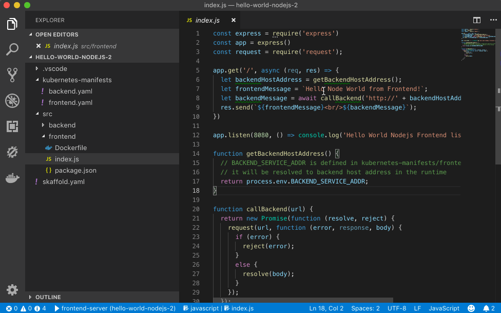

## Edit Inner Loop

We can have a tight development inner loop via `skaffold dev`.  What this does is watch the file system for changes to your files (K8s config or Code) and rebuilds the container and re-deploys to the cluster.

To do this open the VS Code terminal and type `skaffold dev`.  This will start the watcher and from there edits will be reflected in near real time.

Skaffold only builds and deploys the parts you need it to.

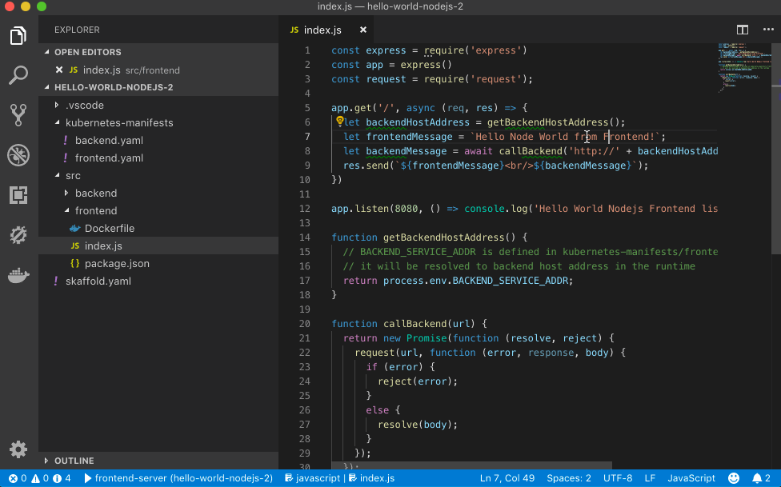

> **TIP:** You may want to disable AutoSave in VS Code if you use this option.

> **TIP:** To exit `skaffold dev` press `ctrl+c`.

## Debugging

We configure the required `launch.json` and docker image updates to allow you to connect VS Codes integrated debugger with your application.

Once you can [deploy](#TODO) to a cluster debugging is as simple as setting a breakpoint and starting the debugger on the relevant microservice.

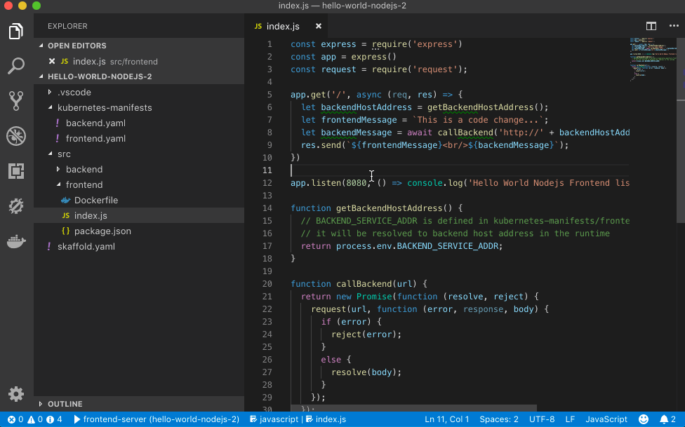

For instance our `KubeCode: New Application` command will produce templates that include the relevant debugger launch configurations.  Below is an example from the NodeJS starter application with a lunch configuration for each of the two included microservices.

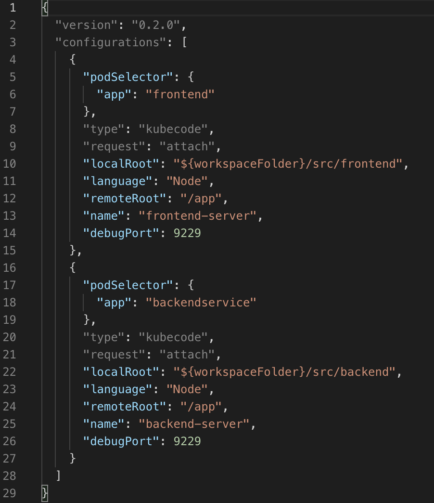

## Kubernetes Explorer

Our extension contributes an explorer to the VS Code activity bar.  This powered by `kubectl` under the covers and will work on any supported cluster.  

To navigate there click on this icon:

From here you can access your K8s clusters and run a variety of commands.

TODO: All the cool stuff you can do from here:
- YAML Diff
- Get IP Address
- Open Browser
- ...

## Working with Logs

Run the command `KubeCode: Stream Logs` and provide the pod and container context.

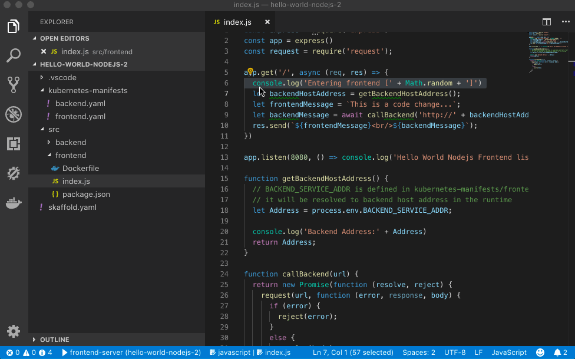

We also support loading the entire log in an editor window via the command `KubeCode: View Logs` and provide the pod and container context.

## Working with K8's YAML

### YAML Validation
As you work with K8's schema we will actively lint them for both structure and valid values.  Errors are directly integrated with VS code's linting (problems) capabilities.  So for instance `F8` can be used to navigate between problems and see a description.

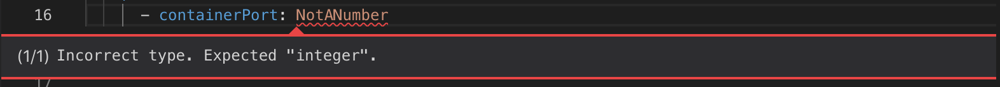 

### YAML Snippets

We provide snippets out of the box for common YAML schema.  These make it easy to start a new YAML file or add to an existing one without errors (and following best practice).  They also make it easy to work with repetitive fields - type them in once and we take care of the rest.

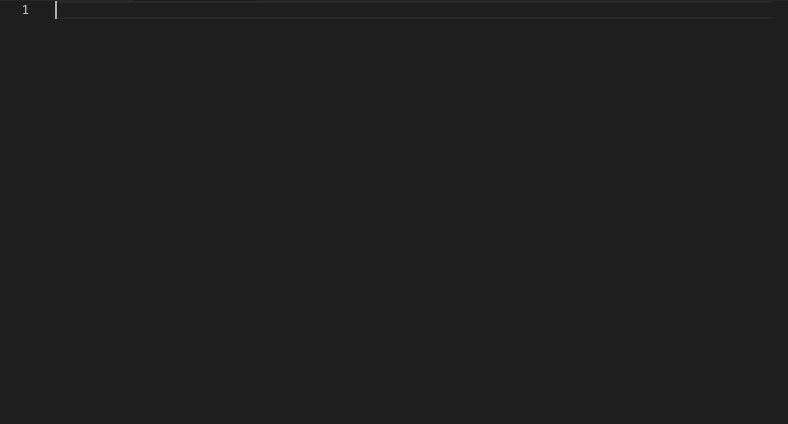

### YAML Completions

We will provide contextual completions within a YAML file based on the current schema - we will even to provide the relevant docs to help you choose the right option.

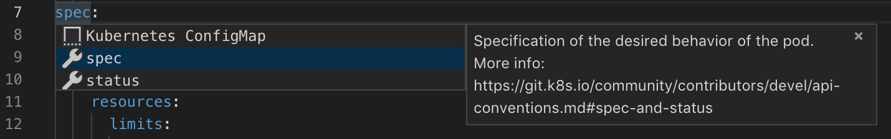

### YAML Documentation on Hover

When you hover over a value we will sho the relevant docs from the schema.

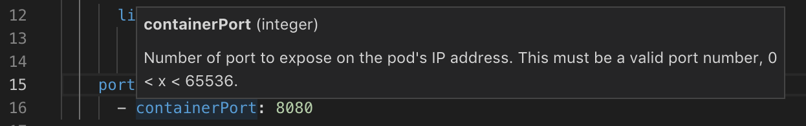

### Working with Secrets

Using config m,aps and secrets is a key part of working with K8's.  Our extension makes it easy to understand the contexts of a base 64 secret with a simple hover to decode.

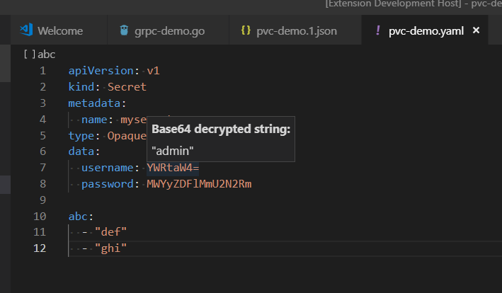

## Support for Cloud Build

TODO

## Support for Cloud Source Repos

It's git and we install the `GCloud CLI` so it just works in terms of VS Codes integrated Git support.

## Command Reference
In the VS Code Command Pallette you can see a set of `KubeCode:` commands to try:

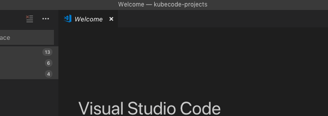

| Command                                                              | Purpose                                              |
|----------------------------------------------------------------------|------------------------------------------------------|
| Help                                                                 | View our welcome experience                          |
| Report Kubernetes' Extension Issue on Github                         | opens a pre-populates issue on Github                |
| [New Application](#create-an-application)                            | Create a new application from a template             |
| [Deploy](#deploy-for-the-first-time)                                 | Deploy the current application to the active cluster |
| Set as Current Context                                               | Set the context for the active cluster               |
| Remove from Context                                                  | Sets the given cluster as the current active cluster |
| Set as Active Namespace                                              | Sets the given namespace as the current active namespace. |
| Refresh Cluster Context Explorer                                     | Refresh the explorer                                |
| [View Logs](#working-with-logs)                                      | Opens a terminal and write out the current logs from the container. |
| [Stream Logs](#working-with-logs)                                    | Opens a terminal and stream logs from the container. |
| Copy Resource Value                                                  | Copy the value of the given resource                 |
| Open Address                                                         |                                                      |
| Describe                                                             | Gives a detailed description of the resource.        |
| Delete                                                               | Deletes the given resource                           |
| Open Dashboard                                                       | Opens the Kubernetes dashboard                       |
| Get Terminal                                                         | Opens a terminal into the container                  |
| Create Kubernetes resource from current file                         |                                                      |
| Diff the current JSON/YAML file with Kubernetes deployed resource    |                                                      |
| Apply the current JSON/YAML file to the Kubernetes deployed resource |                                                      |
| Open Minikube dashboard for starting/stopping local Minikube cluster |                                                      |
| Open Minikube dashboard                                              |                                                      |
| Mount Secret as Volume                                               | Mounts the secret as a deployment in a base-64 decoded file. |
| Add Secret as Environment Variable                                   | Adds an environment variable to the deployment with the value of the secret (base-64 decoded). |

