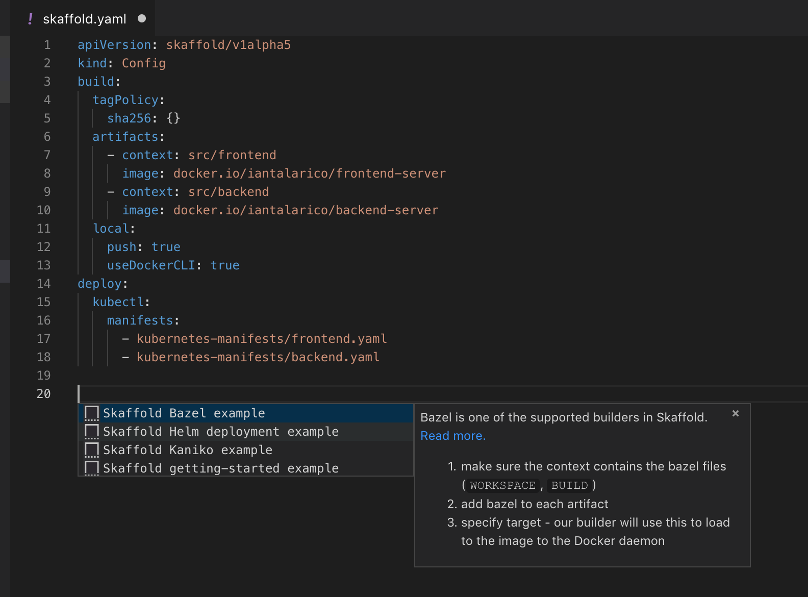

# Cloud Code for Visual Studio Code Feature Tour

> The tools you need for Cloud Native development leveraging your favorite OS, language and cloud.

**Have you ensured your [environment is configured](1_startHere.md) if not do that first.**

This guide is designed to highlight and core features in Cloud Code for Visual Studio Code.  Each section has additional supporting docs linked and there is a catch-all section for cool features not sufficiently covered elsewhere.

In many ways the whole goal of Cloud Code for Visual Studio Code is to let you focus on your code versus needing to loose context and drop to a CLI, portal or some other tool for very common tasks.  As a result we have worked hard to ensure you can work like you normally would in VS Code.

## Create a Cluster

We provide integrated support to create clusters in GKE, AWS, Azure and MiniKube.  Questions will vary by cluster provider, in this case we will use GKE and we must provide:

- Project ID - you can search to refine the list or `project Ids`
- Zone/Region - we provide an of relevant `zone/region` options this
- Configuration - you name the `cluster`, and provide the `agent type`

Creation time will vary depending on the cluster hoster - for GKE you should expect this to take ~2 minutes.

> **Tip:** You can find this command via the `pen` icon in the GKE Explorer.  

## Create an Application

We have the ability to create a new project for you in your language of choice.  This is a great place to start for simple demos and for this feature tour:

- Open the command pallette 
- Select `Cloud Code: New Application`
- Select the language of your choice
- Accept or change the default location

We will then generate a sample application that will allow you to test many of our features.

For more details on what we create and additional options review the [New Application documentation](8_newApplication.md).

> **NOTE:** we will add this to the currently opened workspace - however we suggest you close VS Code and re-open VS code in the new location - ignore the warning about saving the workspace.

## Deploy an Application

The `Cloud Code: Deploy` command will build your containers, push them to the registry, apply cluster configs and then return you the IP address you can use to browse.

## Edit Inner Loop - Continuous Deployment

We can have a tight development inner loop via `Cloud Code: Continuous Deploy` command.  This command continuously watches the file system for changes to your files (K8s config or Code), rebuilds the container(s) and re-deploys to the cluster, so your edits will be reflected in near real time.

This command uses Skaffold underneath and it only builds and deploys the parts you need it to.

> **TIP:** You may want to disable AutoSave in VS Code if you use this option.

## Debugging

We configure the required `launch.json` and docker image updates to allow you to connect VS Codes integrated debugger with your application.

Once you can [deploy](#TODO) to a cluster debugging is as simple as setting a breakpoint and starting the debugger on the relevant microservice.

For instance our `Cloud Code: New Application` command will create applications from pre-defined templates that include the relevant debugger launch configurations.  Below is an example from the NodeJS starter application with a launch configuration for each of the two included microservices.

For more details, refer to the [Debugging Doc](4_debugging.md)

## Kubernetes Explorer

Our extension contributes an explorer to the VS Code activity bar.  This is powered by `kubectl` under the covers and will work on any supported cluster.

To navigate there click on this icon:

From here, you can access your K8s clusters and run a variety of commands, allowing you to interact with K8s resources in a unique and simple way.

Most resources have three basic functions (on top of others listed below):
- Copy Resource Name - Copy the name to the clipboard for easy use
- Describe - Do a `kubectl describe` of the resource.
- Delete - Delete the resource.

For more details on the different functions on each resource, refer to the [Kubernetes Explorer doc](10_kubernetesExplorer.md)

## Working with Logs

Run the command `Cloud Code: Stream Logs` and provide the pod and container context.

We also support loading the entire log in an editor window via the command `Cloud Code: View Logs` and provide the pod and container context.

## Working with K8's YAML

### YAML Validation
As you work with K8's schema we will actively lint them for both structure and valid values.  Errors are directly integrated with VS code's linting (problems) capabilities.  So for instance `F8` can be used to navigate between problems and see a description.

 

### YAML Snippets

We provide snippets out of the box for common YAML schema.  These make it easy to start a new YAML file or add to an existing one without errors (and following best practice).  They also make it easy to work with repetitive fields - type them in once and we take care of the rest.

### YAML Completions

We will provide contextual completions within a YAML file based on the current schema - we will even to provide the relevant docs to help you choose the right option.

### YAML Documentation on Hover

When you hover over a value we will sho the relevant docs from the schema.

### YAML Diffing

You can view the diff between a YAML file in source control and the deployed YAML file.

### Working with Secrets

Using config maps and secrets is a key part of working with K8's.  Our extension makes it easy to understand the contexts of a base 64 secret with a simple hover to decode.

## Support for Cloud Build

TODO

## Support for Cloud Source Repos

It's git and we install the `GCloud CLI` so it just works in terms of VS Codes integrated Git support.

## Working with Skaffold

### Skaffold Snippets

We provide snippets out of the box for Skaffold schema.  These make it easy to start a new Skaffold file or add to an existing one without errors (and following best practice). 

## GKE Explorer
 
The GKE explorer allows basic interactions with GKE resources and directs you to the Google Cloud Console for more advanced scenarios. 

You can view existing clusters, create new clusters and set cluster as the active cluster of kubectl.  This will enable you too easily interact with them in the Kubernetes explorer.

### Set as Active Cluster

## Command Reference
In the VS Code Command Pallette you can see a set of `Cloud Code:` commands to try:

For more details, refer to the (Command Reference)[11_commandReference.md]
