# Cloud Code for Visual Studio Code Release Notes

This page documents production updates to Cloud Code for Visual Studio Code. You can check this page for announcements about new or updated features, bug fixes, known issues, and deprecated functionality.

## Version 1.21.4 (April 2023)

### Bug Fixes

* Exception handling fixes

## Version 1.21.3 (January 2023)

### Updates

* Update to extension name. 

## Version 1.21.2 (January 2023)

### Updates

* Update to OSS Notices.

## Version 1.21.1 (January 2023)

### Notices

* **Upcoming removal of Cloud Run for Anthos powered by KNative functionality:**
  In the next release of Cloud Code (version 1.22.0), functionality enabling viewing and deploying to Cloud Run for Anthos
  clusters powered by KNative will be removed. No changes are being made to non-Anthos Cloud Run functionality.

### Updates

* Let the [Go extension](https://code.visualstudio.com/docs/languages/go) manage dependent debugging
  utilities instead of Cloud Code. [#704](https://github.com/GoogleCloudPlatform/cloud-code-vscode/issues/704)
* Provide a new styled proxy creation wizard for creating Apigee proxies with minimal inputs.
* Auto-refresh Cloud Functions explorer when launch.config is updated.

### Bug Fixes

* Fixes for Google Cloud Functions.
* Exception handling and crash fixes.
* Allow wildcard base paths during Apigee proxy creation. [#708](https://github.com/GoogleCloudPlatform/cloud-code-vscode/issues/708)

## Version 1.21.0 (Dec 2022)

### New Features

* **Cloud Functions:**
  Cloud Code now supports Cloud Functions, helping you [work with your Cloud Functions right from your IDE](https://cloud.google.com/code/docs/vscode/create-deploy-function).
  * Use the Cloud Functions Explorer to view your project's Cloud Functions properties and source code.
  
  * Download your Cloud Functions to [edit your code locally](https://cloud.google.com/code/docs/vscode/setup-local-functions-dev-environment), then [configure your local workspace](https://cloud.google.com/code/docs/vscode/manage-functions-workspace) to deploy those changes directly from Cloud Code.
  
  * Invoke your functions from VS Code and modify your inputs by using any JSON-formatted file.
  
  * Use the Cloud Code Logs Viewer to view logs from your Cloud Functions to debug your code.
  

### Bug Fixes

* Miscellaneous bug and crash fixes

## Version 1.20.4 (Nov 2022)

### Updates

* Supported locations for Cloud Run deployments are now updated dynamically

### Bug Fixes

* Fixed a bug where adding and updating secrets only worked for limited character sets
* Fixes and optimizations related to starting and stopping minikube
* Fixed a bug preventing breakpoints from working correctly when using Buildpacks
* Miscellaneous crash fixes

## Version 1.20.3 (Oct 2022)

### Updates

* Updated crash reporting process

## Version 1.20.2 (Sep 2022)

### Updates

* Cloud Code for VSCode VSIX is now verifiable using the VsixSignTool, [learn more](https://cloud.google.com/code/docs/vscode/install#optional_verifying_vsix_using_vsixsigntool). 
* Improved code snippet accuracy and UX for the Cloud APIs explorer including some new features
  * Added new Feedback button in snippets.
    
  * Added product icons to improve scannability.
    

## Version 1.20.1 (Aug 2022)

### Updates

* Update August 1.20.0 changelog wording

## Version 1.20.0 (Aug 2022)

### New Features

* **Google Compute Engine:**
  Cloud Code now supports Google Compute Engine helping you [work with your Virtual Machines right from your IDE.](https://cloud.google.com/code/docs/vscode/manage-vms)
  * Use the Compute Engine Explorer to [view the properties of your VMs](https://cloud.google.com/code/docs/vscode/manage-vms#viewing_vms) and quickly access the Cloud Console to edit these properties.
  * Use the [Open SSH](https://cloud.google.com/code/docs/vscode/manage-vms#connecting_to_a_vm) button in the explorer to open a VS Code integrated terminal SSH'd into your VM instance. If the connection fails, Cloud Code will help you troubleshoot common connectivity issues.
    
  * Use the [Upload File via SCP](https://cloud.google.com/code/docs/vscode/manage-vms#uploading_a_file_to_a_vm) button to upload files from your local client to your VM instance. Once files are uploaded, you can easily access them in your instance's home directory using the SSH connection provided by Cloud Code.
    
  * Use the [View Logs](https://cloud.google.com/code/docs/vscode/manage-vms#viewing_application_logs_on_a_vm) button to open the Cloud Code Logs Viewer to view logs from your VMs to help you debug your applications.
  

### Updates

* Using Cloud SQL database connections in Cloud Run Emulator no longer requires a service account. If you specify a Cloud SQL database without specifying a service account, your Application Default Credentials will be used to authenticate a connection to the database.
* Some Kubernetes Explorer functionality has been updated to call your cluster’s control plane API directly instead of using kubectl to retrieve the data. This significantly reduces the computational overhead and latency of the Kubernetes Explorer, especially on Windows machines where spawning processes is expensive.

### Bug Fixes

* Skaffold clean up error [#606](https://github.com/GoogleCloudPlatform/cloud-code-vscode/issues/606)
* Error deploying with cloudsql connection [#613](https://github.com/GoogleCloudPlatform/cloud-code-vscode/issues/613)
* Fixed an issue where child processes might continue to run after exiting VS Code

## Version 1.19.0 (Jul 2022)

### New Features

* **Cross-Platform Local Docker Builds:**
  Cloud Code now supports building cross-platform Docker container images locally using Docker BuildX.
  * When running/debugging on Kubernetes, the platform of the target cluster is automatically detected and container images are built for that platform, irrespective of the client platform.
  * Warnings to use Cloud Build as a workaround no longer appear for users on ARM64 clients such as M-series MacOS devices when deploying to AMD64 platforms such as GKE and Cloud Run.

### Updates

* Removed requirement for Rosetta on M-series MacOS devices, as all our dependencies are now built for ARM64.
* UX Improvement for Cloud Code in IDE survey

### Bug Fixes

* Extension 'Cloud Code' is configured as formatter but it cannot format 'YAML' files [#587](https://github.com/GoogleCloudPlatform/cloud-code-vscode/issues/587)
* Various bug fixes and stability improvements.

## Version 1.18.3 (May 2022)

### Bug Fixes

* Enhanced error reporting options for minikube startup
* Various bug fixes and stability improvements.

## Version 1.18.2 (May 2022)

### Bug Fixes

* Various bug fixes and stability improvements.

## Version 1.18.1 (Apr 2022)

### Bug Fixes

* Reducing VSCode version requirement for Cloud Code from 1.66 to 1.63.

## Version 1.18.0 (Apr 2022)

### Updates

1. **Single Activity Bar Icon:**
  We reduced the amount of space Cloud Code takes on your screen by reducing our five activity bar icons to one.

2. **New Project Selector Status Bar:**
  Cloud Code shows your active Google Cloud project in the status bar so you are always aware what project an action will apply to. You can click the status bar item to change the project.

3. **Unified Explorer**
  All Cloud Code resource explorers are now consolidated under the single Activity Bar icon.

* **Minikube Status Bar Relocation:**
  To make room for the project selector status bar, we moved the Minikube Status Bar functionality into an option in the Cloud Code Status Bar menu.

## Version 1.17.2 (Apr 2022)

### Bug Fixes

* Fixed an issue where running a Cloud Run app locally on Cloud Run Emulator breaks when Skaffold v1.37.1 is installed.

## Version 1.17.1 (Mar 2022)

### Updates

* When a Run/Debug session is started without an open workspace, Cloud Code will recommend that you open a workspace or create a new sample application.
* **Project Selector Improvements:** You can now easily switch accounts, create a new project, and refresh the list of projects directly from the project picker.

### Bug Fixes

* Extension causes high cpu load [#523](https://github.com/GoogleCloudPlatform/cloud-code-vscode/issues/523)
* Fixed an issue where getting started information and samples in the Google Cloud API Detail viewer might not reflect the chosen language.

## Version 1.17.0 (Dec 2021)

### New Features

* **Private Cluster Support:**
  Cloud Code provides guidance and helper utilities to help you connect to your [GKE private clusters](https://cloud.google.com/kubernetes-engine/docs/how-to/private-clusters).

  * When there is an issue connecting to a private cluster, Cloud Code shows error messages with suggested workarounds for the private cluster configuration it detects. To see the workarounds, click a broken cluster in the Kubernetes Explorer. Notifications also appear when connection errors occur.
  

  * Cloud Code helps you set up proxying for a cluster, which is useful for when the public endpoint to the Control Plane API is not accessible from your client network and you must proxy API requests through a server in the same
  

  * Cloud Code will help you set up a [Cloud NAT](https://cloud.google.com/nat/docs/overview) configuration for your GKE cluster’s VPC so nodes have outbound internet access. By default, GKE private clusters don't provide nodes with access to the public internet, which makes container image repositories outside Google Cloud inaccessible.
  

* **Artifact Registry Support:**
  UI improvements make it easier to configure your Kubernetes deployments to store images using Artifact Registry. To have the Artifact registry option appear in the UI, the active Google Cloud project must have the Artifact Registry API enabled and at least one Artifact Registry repository.

  * If an Artifact Registry Repo exists within your project, you can select the option to push images to an Artifact Registry repo.
  

  * Select the Artifact Registry repo you wish to deploy to.
  

  * Input the path within the chosen repo that the image should be stored at.
  
* **Multi Microservice development:**
Module-based application deployment through [Skaffold modules](https://cloud.google.com/code/docs/vscode/skaffold-modules) helps individual developers to iterate on part of the application.
  * **Run on Kubernetes** supports deploying one or more modules rather than deploying your entire application. You can configure the set of modules in your launch configuration (launch.json file) > **skaffoldFlags > modules**.
  * To see modules-based application deployment in action, try out one of the Cloud Code Kubernetes Guestbook sample applications by creating a new sample project (**Run Cloud Code: New Application** from the command palette).
  

### Updates

* **New Welcome Page experience**
  

  * **Guided Tour Link:**
  In addition to samples, the Welcome page includes one-click access to a guided tour in Cloud Shell Editor so that you can try various Cloud Code features out without any setup. Cloud Shell Editor is a Theia-based code editor available by default with every Cloud Shell instance.
  

  * **Feature Highlight:**
  A new section to learn about what you can achieve with Cloud Code in Kubernetes, Cloud Run, Secret Manager and more.
  

  * **Documentation Links:**
  Access various documentations including Skaffold and minikube.
  
  * Try it on! Type **"Cloud Code > Welcome"** into the command palette to see the new experience.

### Bug Fixes

* Fixed Python debug issue [#494](https://github.com/GoogleCloudPlatform/cloud-code-vscode/issues/494)
* Fixed issue with IntOrString [#488](https://github.com/GoogleCloudPlatform/cloud-code-vscode/issues/488)
* Added kustomization schema [#478](https://github.com/GoogleCloudPlatform/cloud-code-vscode/issues/478)

## Version 1.16.1 (Nov 2021)

### Updates

* Fixes an issue where API Browser is not loading without Internet connection.

## Version 1.16.0 (Nov 2021)

### New Features

* **Apigee (API Management) in VS Code:**
  * Apigee in VS Code enables developers to develop API proxies and shared flows and verify the functionality through unit and manual testing using the Apigee Emulator (local runtime).  Apigee in VS Code provides:
    * Basic management of multiple environments
    * Specialized wizards for developing proxies and shared flows
    * Automatic injection of Apigee variables in policies and scripts
  * Develop API proxies using specialized wizards
    
  * Deploy and test your Apigee API proxies
    
  * Create policies using pre-configured snippets and use auto-complete features to insert variables
    
  * Install and manage Apigee Emulators (local runtime)
    

### Updates

* **New API Browser experience:**
  * Discover code snippets in the IDE. Added a “Code Samples” tab where you can search for and use code samples for each GCP API exposed in the API Browser.
    * Click “Cloud Code - Cloud APIs”.
    * To open the detail view, click the name of an API.
    * To view code samples for the API, click “Code Samples”.
    * To filter the list of samples, type text to search for or choose a programming language from the “Language” list.
    * To view a sample, click the name of the sample. There are also options to copy the sample to your clipboard or view the sample in GitHub.
   

### Bug Fixes

* Cloud Run Emulator: UI bug when adding environment variable [#485](https://github.com/GoogleCloudPlatform/cloud-code-vscode/issues/485)

## Version 1.15.1 (Oct 2021)

### Updates

* **Temporarily Disabling Iterative Debugging:** Due to an issue identified in Skaffold v1.33.0, we are temporarily disabling watch mode for debugging. Please follow [#486](https://github.com/GoogleCloudPlatform/cloud-code-vscode/issues/486) for more information and updates.

## Version 1.15.0 (Oct 2021)

### New Features

* **Kubernetes Dry-Run in Language Server:** Cloud Code’s YAML Language Server now performs a server-side dry-run on your file as you type, and reports problems right in the editor.

### Updates

* **Dependency Install Welcome View:** We now show a Welcome View on all explorers that are blocked due to dependency install or upgrade.

### Bug Fixes

* Option for Get Terminal to run '/bin/bash' instead of 'sh' [#464](https://github.com/GoogleCloudPlatform/cloud-code-vscode/issues/464)
* Settings: Cloudcode › Yaml: Kubernetes Version outdated? [#476](https://github.com/GoogleCloudPlatform/cloud-code-vscode/issues/476)

### Features available in [Insiders](https://cloud.google.com/code/docs/vscode/insiders)

* **Support for Skaffold modules:** “Run on Kubernetes” now supports running one or more Skaffold modules rather than deploying your entire application. You can configure the set of modules in your launch configuration (launch.json) > skaffoldFlags > modules.
* **Apigee integration:** Cloud Code now features integration with your Apigee workspaces, with editing and local emulator support.
* **New API Browser experience:** Code Samples browsing tab is integrated with the API browser. You can browse and copy code samples from different Google Cloud API Client Libraries. Available for NodeJS, Python, Go and Java.

## Version 1.14.1 (Sept 2021)

### Bug Fixes

* Fixes a race condition for Skaffold that caused low CPU resource scenarios to hang [#469](https://github.com/GoogleCloudPlatform/cloud-code-vscode/issues/469)

## Version 1.14.0 (Sept 2021)

### New Features

* **New and Improved Kubernetes Development Experience:** Your Kubernetes development sessions now have a vastly improved experience with the new Development Sessions explorer!

  * See exactly which task is executing and the status of each task.
    
  * View the full session logs.
    
  * Or drill down the logs of an individual task to quickly identify errors.
    
  * Stream your application logs at the container level.
    
  * Browse the deployed Kubernetes resources in the cluster, scoped to the session and quickly access the pod terminal.
    

* **Logs Viewer Refresh:** Logs Viewer is redesigned to give more room for the logs with no functionality changes.

  * Introduced pagination control to the logs table, by default the logs table shows 50 entries.
    

### Updates

* **Cloud Run Emulator on Local Network:** Cloud Run Emulator now includes an option to port forward your service to `0.0.0.0` so you can debug it on other devices on the local network, such as your phone. To use this, check the Make the service accessible from other devices on the local network checkbox in the setup UI, or set `externalPortForward` in your launch.json configuration to the port you want the service exposed on. [#444](https://github.com/GoogleCloudPlatform/cloud-code-vscode/issues/444)
* **YAML Editing Support unavailable warning:** When editing a Kubernetes YAML file, Cloud Code warns you if it doesn't recognize the schema. When this occurs, verify that the `Version` and `Kind` of your YAML configuration is correct.

### Bug Fixes

* Managed Dependency Check Failed [#462](https://github.com/GoogleCloudPlatform/cloud-code-vscode/issues/462)
* Extension Failure: Managed Dependencies Off [#452](https://github.com/GoogleCloudPlatform/cloud-code-vscode/issues/452)
* Not enough differentiability between GKE resource status markers [#425](https://github.com/GoogleCloudPlatform/cloud-code-vscode/issues/425)

## Version 1.13.2 (Aug 2021)

### Bug Fixes

* Fixed an issue about collecting feedback and log refresh.

## Version 1.13.1 (July 2021)

### Updates

* **Cloud Run timeout:** Increased deployment timeout to 3600 seconds, preventing long running deployments from failing.
* **Gcloud dependency beta removal:** Removed the usage of gcloud alpha commands since all features are now in General Availability or in Beta.
* **Convenient bug reporting:** Added a webview to conveniently upload stack traces for bug reports.
* **Suppress feedback notification**: Added feature to suppress error feedback notification based on frequency.
* **Remove out-of-context Cloud Code commands**: Removed unnecessary commands from the palette that are out of context.

### Bug Fixes

* Changed default service and image names to kebab case to deal with spaces, symbols, and uppercase letters present in workspace folder name. [#436](https://github.com/GoogleCloudPlatform/cloud-code-vscode/issues/436)
* Surface errors due to unknown Skaffold API version in skaffold.yaml.
* Better recovery from an unsuccessful gcloud installation.
* Improved error handling when using the minikube status bar.

## Version 1.13.0 (June 2021)

### New Features

* **Simplified combined Kubernetes Explorer and Google Kubernetes Engine Explorer experience** Google Kubernetes Engine Explorer is now merged into Kubernetes Explorer for a unified experience. Kubernetes Explorer now takes you to the Cloud Console for GKE cluster management operations, such as creation and deletion of clusters. Managing cluster types other than minikube and GKE is no longer supported; you’ll need to use the cloud provider's tools to create other cluster types and add them to your KubeConfig.

* **Iterative debugging** When you're in debug mode and you make a change to your project, Cloud Code now redeploys your project and sets up a new debug session. You can toggle this feature with the “watch” flag in the launch configuration of your project. By default, “watch” is set to true (similar to run mode).

* **Change Build Environment on the fly** If, when you begin your Run/Debug on Kubernetes session, Cloud Code detects that you aren't using a recommended build environment for your development environment, you will have a chance to modify the build environment in your current Skaffold profile or change your Skaffold profile to one that uses a recommended build environment.

* **Auto-start docker prompt** When running or debugging Kubernetes and Cloud Run, you now are presented with a new quick-pick menu to start Docker service as part of the dependency check.

### Updates

* **Managed Cloud SDK performance improvements** Improvements to the managed Cloud SDK installation process means much of Cloud Code functionality is now available 2 to 5x times faster upon installing the extension.  Additionally, these improvements come with reduced memory consumption and fewer fatal/corruption errors.

* **Improvement to Cloud Run local development webview** The webview now immediately shows any input error without needing to click “Run” button.

### Bug Fixes

* Fixed the application name to use kebab case while cloning template repos. [#430](https://github.com/GoogleCloudPlatform/cloud-code-vscode/issues/430)

## Version 1.12.1 (June 2021)

### Bug Fixes

* Fixed an issue where debug path mapping was broken with Skaffold 1.25.0.

## Version 1.12.0 (May 2021)

### New Features

* **Build with Cloud Build** When Deploying to Cloud Run or Running/Debugging on Kubernetes, you can select to build with [Cloud Build](https://cloud.google.com/build). Cloud Code will guide you through setting up Cloud Build in your project, and then will automatically configure and submit builds for each image to the cloud. Cloud Code will also make suggestions to use Cloud Build based on your current development environment. For example, Cloud Build will be recommended for deployment to GKE from ARM based clients because of the processor architecture mismatch.

* **Minikube Auto Stop** Improved client side performance for auto scheduling the minikube clusters started by cloud code.

### Updates

* **Cloud Run** Cloud Run managed deployments now allow up to 8 GiB memory for any deployments with at least 2 vCPUs allocated.

### Bug Fixes

* Fixed an issue where validation to have docker installed is not needed when using Google Cloud Build for deploying applications.
* Support multiple skaffold configurations in one single configuration file. [#424](https://github.com/GoogleCloudPlatform/cloud-code-vscode/issues/424)

## Version 1.11.1 (May 2021)

### Bug Fixes

* Fixed an issue where views were slow to load in Visual Studio Code 1.56.0.

## Version 1.11.0 (April 2021)

### Updates

* **Updated Explorer setup experience:** Explorers that require any setup steps now guide you through the process of logging in, selecting a project, and enabling any required APIs in a more interactive and friendly way.
* **Streamlined Explorer views:** Secret values in Secret Tree View and ConfigMaps’ values in Kubernetes Explorer are now accessible in read-only (instead of editable) documents.
* **Enhanced minikube management:** Multi-step quick pick menu for minikube now comes with cancel and back buttons for easy navigation.
* **Prompt toggling for M1 macs:** Suppress warnings that the extension might not work on M1 with improved prompt toggling. [#415](https://github.com/GoogleCloudPlatform/cloud-code-vscode/issues/415)
* **Quieter watch mode:** Watch mode no longer displays Deployment Successful prompts.
* **Improved error state:** Get unstuck quicker with more proactive error messaging in the Kubernetes local development webview.

### Bug Fixes

* Fixed an issue where .NET debugger was using the wrong debugger path with Skaffold. Added `debuggerPath` and `processId` field to the .NET debugger to enable setting the debugger path and process ID of the debuggee. [#397](https://github.com/GoogleCloudPlatform/cloud-code-vscode/issues/397), [#418](https://github.com/GoogleCloudPlatform/cloud-code-vscode/issues/418)
* Fixed an issue where the artifacts property needed to be specified under the default skaffold’s profile even when there were additional profiles. [#398](https://github.com/GoogleCloudPlatform/cloud-code-vscode/issues/398)
* Fixed an issue where multiple prompts to install necessary version of Cloud SDK that take up screen space. [#414](https://github.com/GoogleCloudPlatform/cloud-code-vscode/issues/414)
* Fixed an issue where the Enable Cloud Run API button was disabled in the Cloud Run WebView.

## Version 1.10.0 (March 2021)

### New Features

* **GKE Autopilot Cluster Creation:** You can now create [GKE Autopilot](https://cloud.google.com/kubernetes-engine/docs/concepts/autopilot-overview) clusters with the Cluster Creation wizard for a more managed mode of operation, taking advantage of Autopilot’s auto-provisioning and autoscaling of GKE infrastructure. For more details on how to configure your cluster, see the [Adding a cluster](https://cloud.google.com/code/docs/vscode/adding-a-cluster#creating_or_using_an_existing_kubernetes_cluster_with_gke) guide.

* **Initial support for M1-based Apple Silicon Macs:** With this update, you can now build and work locally on your M1 Mac with Cloud Code, minikube, and Skaffold for ARM64 targets. Please note that [Rosetta 2](https://support.apple.com/en-us/HT211861) is currently required as several dependencies are still x86/64 only, refer to [instructions](https://cloud.google.com/code/docs/vscode/arm). Follow this [GitHub issue](https://github.com/GoogleCloudPlatform/cloud-code-vscode/issues/390) for more information and to track the latest updates.

### Updates

* **Dry-run YAML Files:** Perform a dry run of your configuration and check its validity using the newly added dry-run command (with either client-side or server-side validation). Dry-run evaluates the resource request without persisting objects to storage, and displays the validation result as a toast notification. To discover more commands to help with editing your configuration files, see the [YAML editing](https://cloud.google.com/code/docs/vscode/yaml-editing#performing_a_dry-run_of_a_yaml_file) guide.

### Bug Fixes

* Fixed passing environment variables to skaffold.yaml for customizing build arguments. [#394](https://github.com/GoogleCloudPlatform/cloud-code-vscode/issues/394), [#378](https://github.com/GoogleCloudPlatform/cloud-code-vscode/issues/378)
* Fixed the ability to specify skaffold tags (like docker image tags) through launch config for customization. [#335](https://github.com/GoogleCloudPlatform/cloud-code-vscode/issues/335)
* Fixed skaffold workspace to support config from non-root directory. [#377](https://github.com/GoogleCloudPlatform/cloud-code-vscode/issues/377)
* Fixed the need to avoid specifying service/container name when Cloud Run is running on an emulator. [#295](https://github.com/GoogleCloudPlatform/cloud-code-vscode/issues/295)
* Fixed an issue where the insiders build gave an inactionable error message on network failures. [#404](https://github.com/GoogleCloudPlatform/cloud-code-vscode/issues/404)

## Version 1.9.0 (February 2021)

### New Features

* **GKE Autopilot:** You can now deploy your application to GKE Autopilot right from VSCode Cloud Code menu. GKE Autopilot is a new mode of operation of GKE clusters where infrastructure is auto managed by Google, provides auto provisioning and auto scaling of GKE infra to the end user. Overview of [GKE Autopilot](https://cloud.google.com/kubernetes-engine/docs/concepts/autopilot-overview).
* **Pre-release Channel:** You can now use insider builds for trying out upcoming features and give us feedback before they are publicly released. You can go to cloud code settings “Cloud Code: Update Channel” and select an insider build that you want to try out. This will help us to make sure your development tools aren’t affected by the release of Cloud Code Plugin.

### Bug Fixes

* Fixed to avoid checking for dependencies while deploying to K8 if deps are not auto managed. [#375](https://github.com/GoogleCloudPlatform/cloud-code-vscode/issues/375)
* Fixed broken link to browse launch.json config in the output window of deployment logs.

## Version 1.8.0 (January 2021)

### New Features

* **Custom templates:** You can now create applications from custom templates! Cloud Code offers the option of importing a Git template repository so that teams can get started quickly from a standard set of starter applications, services, and infrastructure configuration best suited to teams’ organizational policies. To read more about templates and how to get started, head over to [setting up a template repository](https://cloud.google.com/code/docs/vscode/set-up-template-repo) guide.

* **Cloud Code Status Bar options:** Discover more about your currently active sessions with these additions to the Cloud Code status bar.
  * **Open Service URL:** Instead of scrolling through the logs to find the service URL, you can now open the application service URL in a web browser directly from the status bar.
  * **Open Deployment Logs:** Open the application logs with the Cloud Code Logs Viewer. This populates the necessary filters in the Logs Viewer for the selected deployment.
  * **Turn on/off Watch Mode:** Toggle watch mode (not available for debug session currently). This allows you to turn on/off watch mode for the current active run session without stopping, changing the launch.json `watch` field, and redeploying. Note that this toggle only affects the current session and not subsequent ones.

* **New sample application READMEs:** When you create a new sample application with Cloud Code, the new README gives updated guidance on next steps to help you get more out of Cloud Code.

### Updates

* **.NET launch debugging support:** In addition to the attach configuration, Cloud Code now supports a launch configuration for .NET. You can now deploy and attach to a .NET application with a single configuration.
* **New home for Cloud Run properties:** Cloud Run properties no longer show up in a separate view. They can be found conveniently in the Cloud Run Explorer under **Properties**.

### Bug Fixes

* Fixed Cloud SDK auto dependency installation corruption issue on Windows. [#346](https://github.com/GoogleCloudPlatform/cloud-code-vscode/issues/346)
* Fixed Python enabling to debug external sources. [#328](https://github.com/GoogleCloudPlatform/cloud-code-vscode/issues/328)
* Fixed YAML outline to handle arrays of objects. [#339](https://github.com/GoogleCloudPlatform/cloud-code-vscode/issues/339)
* Fixed available cluster listing when faced with restricted project permissions. [#318](https://github.com/GoogleCloudPlatform/cloud-code-vscode/issues/318)
* Fixed docs for Cloud Run service config, discovering logs, stopping the emulator. [#298](https://github.com/GoogleCloudPlatform/cloud-code-vscode/issues/298)
* Fixed an issue where installation of minikube is not required for deploying to Kubernetes cluster. [#280](https://github.com/GoogleCloudPlatform/cloud-code-vscode/issues/280)
* Fixed an issue to display deployment progress failures on the right side status bar.
* Fixed an issue that allows users to switch accounts without running into permission requests on older accounts.

## Version 1.7.2 (January 2021)

### Bug Fixes

* Fix an issue where dependencies path gets invalidated on Windows. [#362](https://github.com/GoogleCloudPlatform/cloud-code-vscode/issues/362)
* Fix an issue where Cloud SDK in the path gets corrupted on Windows since there is reentry while installing dependencies. [#347](https://github.com/GoogleCloudPlatform/cloud-code-vscode/issues/347)

## Version 1.7.1 (December 2020)

### New Features

* **Project Selection Flows:** The project selector has been refreshed to deliver an improved UX, faster load times, and recent projects listed first. The project selection/login/logout should sync between all webviews and explorers.

* **Refresh GKE Explorer:** The look and feel of the GKE Explorer is now consistent with the Secret Manager Explorer and the Cloud Run Explorer.
* **YAML Editing Support:** YAML editing support can now accurately be limited to a subdirectory under the working directory by setting `cloudcode.yaml.yamlFileMatcher`. [Learn more](https://cloud.google.com/code/docs/vscode/yaml-editing)

### Updates

* Replace general icons with VSCode Codicons for commands.
* Improved Cloud Run (fully managed) support:
* Allocate up to 4 vCPUs to container instances with the increased limit.

### Bug Fixes

* Fix .NET debugging fails to open a source file when the breakpoint is hit. [#292](https://github.com/GoogleCloudPlatform/cloud-code-vscode/issues/292)
* Refresh AKS cluster UI after modifying the active subscription. [#239](https://github.com/GoogleCloudPlatform/cloud-code-vscode/issues/239)

## Version 1.7.0 (October 2020)

* **Secret Manager Support:** Many applications require credentials to connect to a database, API keys to invoke a service, or certificates for authentication. Cloud Code now integrates with Google Cloud's Secret Manager to make it easy to create, view, update, and use secrets from within your IDE so you can keep this sensitive data out of your codebase and keep your applications secure.  Get started today by viewing secrets, creating a new secret, or add secret manager API support to your code.   You can learn more about Secret Manager support from [the Cloud Code Secret Manager documentation](https://cloud.google.com/code/docs/vscode/secret-manager).

  * View secrets, their versions, permissions, and properties in the Secret Manager view.
    

* **Minikube Credentials Support:** When running or debugging on Cloud Run Emulator or minikube, Cloud Code will automatically set up the [minikube gcp-auth](https://minikube.sigs.k8s.io/docs/handbook/addons/gcp-auth/) addon. This will enable you to use your Google developer credentials to authenticate Google API client libraries in your apps when running in these environments with zero configuration required. Cloud Code also has a new login flow to ensure you have developer credentials installed when you login.

* **Managed Dependencies in Integrated Terminal:** You can now use Cloud Code managed dependency CLIs, such as minikube and gcloud, through VSCode Integrated Terminals.
  

### Updates

* **Improved Cloud Run (fully managed) support:**

  * Deploy Cloud Run services from your IDE to these newly added regions. View the full supported list [here](https://cloud.google.com/run/docs/locations).

  * Allocate up to 4GiB of memory to your services with the increased quota.

### Bug Fixes

* Minikube status checks are aggressive and lead to generating more log files that can slow down other build tools. The change is to remove the live status bar but use minikube status bar to monitor status of different profiles and is less invasive. [#286](https://github.com/GoogleCloudPlatform/cloud-code-vscode/issues/286) [#313](https://github.com/GoogleCloudPlatform/cloud-code-vscode/issues/313)

* Cloud run emulator didn’t bootstrap itself on windows since it chose the hyper-v that got blocked on the need for special permissions, Cloud code now defaults to using docker driver for the emulator.

* Regions are not available when I use "Deploy to Cloud Run". [#314](https://github.com/GoogleCloudPlatform/cloud-code-vscode/issues/314)

## Version 1.6.0 (Septemeber 2020)

### New Features

* **Improved performance:** Reduced load times for populating the GKE explorer (from  about a 12 second load time to under 5 seconds!); logging out or switching accounts is now a much faster experience.

* **Kubernetes run/debug bootstrapping improvements:** Cloud Code now helps you set an active context at the start of a run or debug session to help you get your Kubernetes application deployed quickly. If you don’t have any contexts, Cloud Code helps you create one.

  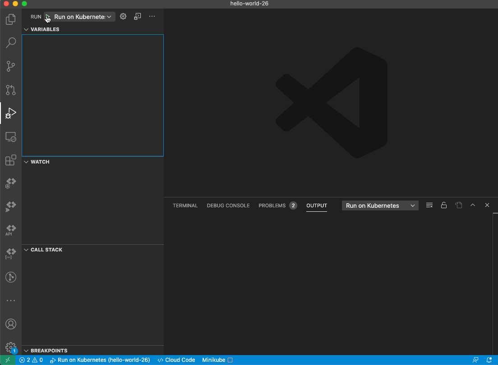

* **Auto-start minikube:** Cloud Code now manages minikube more proactively. When running/debugging on a minikube cluster that is paused or stopped, Cloud Code automatically starts the cluster at the beginning of the session and pauses it when you’re done.

  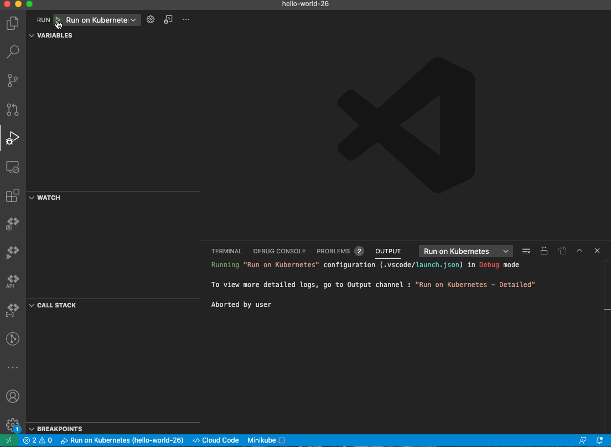

## Version 1.5.0 (August 2020)

### New Features

* **Cloud Run local development:** Develop Cloud Run applications locally using Minikube clusters with the newly added
Run and Debug on Cloud Run Emulator commands.

  

* **Expanded CRD support:** Cloud Code has been expanded to support validation, hover documentation, and code
completions for hundreds of popular Kubernetes Custom Resources.

  

* **Buildpacks support:** In addition to Docker, you can now build your images with Google Cloud buildpacks.

  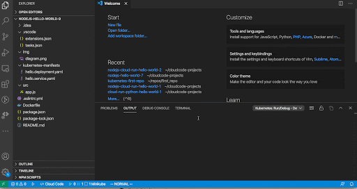

* **Auto generate configuration experience for existing K8s apps:** The UI that helps auto generate configuration for
an existing app moving in to using Cloud Code extensions now supports specifying all available build and
configuration settings.

  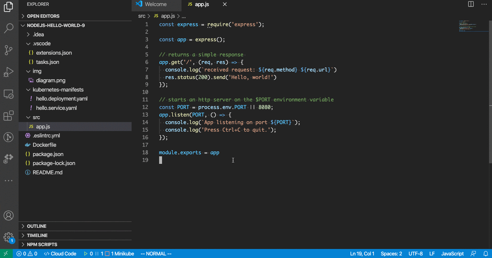

* **Improved New Application UI:** Creating a new application now uses the system file picker to help you quickly place the new files in a familiar way. You can rename the new application folder through your system file manager.

  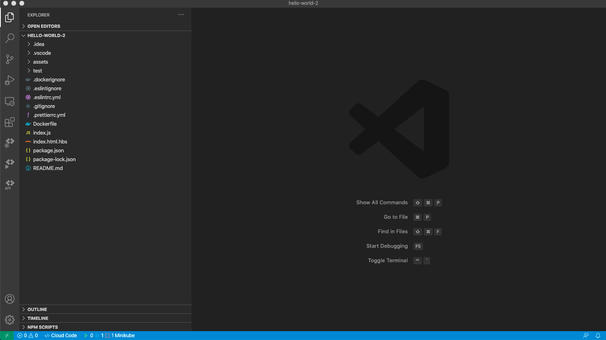

## Version 1.4.0 (May 2020)

### New features

* **Kubernetes Context Management:** Contexts are now accessible from the Kubernetes Explorer!
You can now browse and switch between Kubernetes contexts as you would during your development workflow with Cloud Code. With the updated Kubernetes Explorer, it's easier to understand
the active context associated with your current cluster and move to another if you need.

  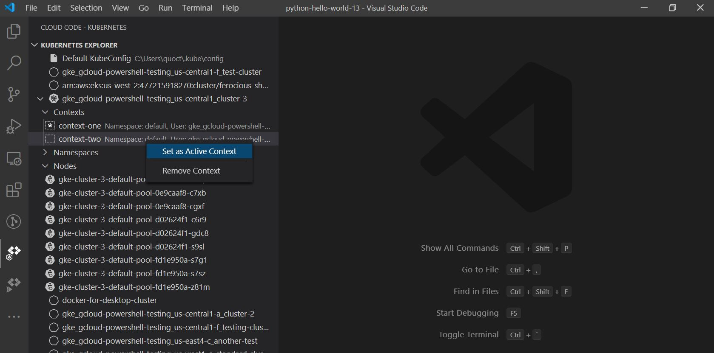

* **PersistentVolumeClaim support:** The Kubernetes Explorer will now show your cluster's PersistentVolumeClaim (PVC) resources and each PVC's status and key details.

  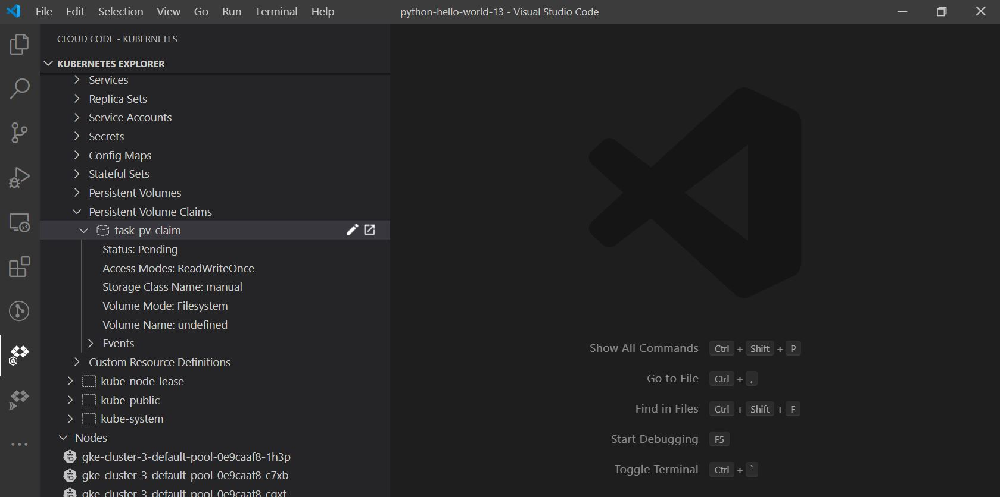

### Bug Fixes

* Cloud Code will now allow you to browse and switch between Kubernetes contexts. [#131](https://github.com/GoogleCloudPlatform/cloud-code-vscode/issues/131)
* You can now browse PersistentVolumeClaim in the Kubernetes Explorer. [#193](https://github.com/GoogleCloudPlatform/cloud-code-vscode/issues/193)

## Version 1.3.0 (April 2020)

We are pleased to announce [Cloud Run](https://cloud.google.com/run) support in Cloud Code for VS Code!

### New Features

* **Cloud Run support in VS Code:** Cloud Code now makes it easy to develop and deploy your services to Cloud Run (fully managed) or Cloud Run for Anthos on GKE directly from within Visual Studio Code.  You can get started with our starter templates for Java, Node.js, Go, or Python.
  * Browse your Cloud Run services directly from the IDE using the Cloud Run explorer. Easily see details of deployed services as well as revisions and status.
  * Follow the [Cloud Run quickstart guide](https://cloud.google.com/code/docs/vscode/quickstart-cloud-run) to get started!

  

* **Improved dependency management:** Better experience when Cloud Cloud is managing dependencies.
  * Improved performance when installing managed dependencies.
  * Stay up to date with the latest versions of dependencies.

* **Cloud Code: Debug on Kubernetes:**  New command to debug applications with the same configuration used to [run the application](https://cloud.google.com/code/docs/vscode/running-an-application).
  * Invoking this command will launch the application and debugs all the containers in the app.
  * Refer to the [documentation](https://cloud.google.com/code/docs/vscode/debug) for more on this feature.

  

* **Separate views for Kubernetes, Cloud Run and APIs:** Reorganized UI to focus on the flows that matter.

  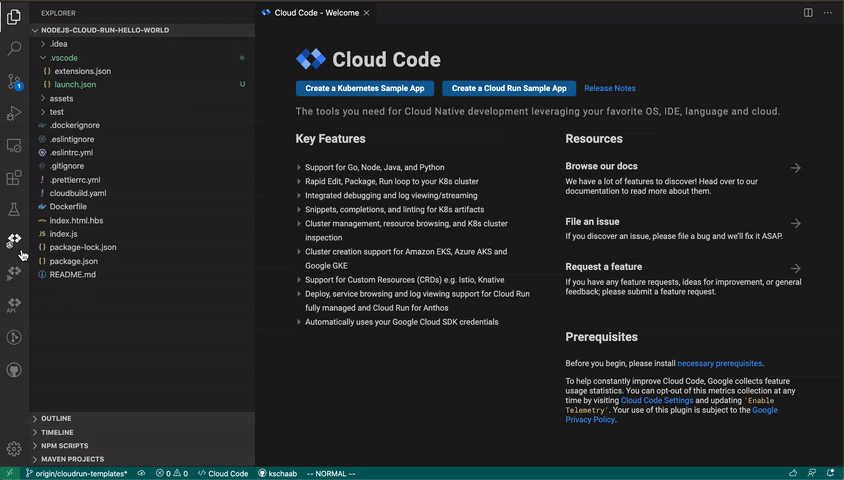

### Other Changes

* **Dependency management:** Previously offered "On," "Off," and "Ask" as choices for managing dependency with "Ask" as the default. In the latest release we've removed the "Ask" choice with "On" as the default. Anyone who has picked "Ask" will be defaulted to "On."
* **Deprecation of Kubernetes deploy commands:** The deprecated ‘Cloud Code: Deploy’ and ‘Cloud Code: Continuous Deploy’ have been removed. Use ‘Cloud Code: Run on Kubernetes’ command.

### Bug Fixes

* Add support for Google Cloud Run. [#231](https://github.com/GoogleCloudPlatform/cloud-code-vscode/issues/231)
* Hanging while installing dependencies. [#227](https://github.com/GoogleCloudPlatform/cloud-code-vscode/issues/227)
* Cannot start debugger for .NetCore project. [#225](https://github.com/GoogleCloudPlatform/cloud-code-vscode/issues/225)
* GKE Explorer does not work in windows 10. [#224](https://github.com/GoogleCloudPlatform/cloud-code-vscode/issues/224)
* Add Configuration to Existing Project is broken. [#223](https://github.com/GoogleCloudPlatform/cloud-code-vscode/issues/223)
* Add a guidance message in case no Kubernetes manifest are present. [#203](https://github.com/GoogleCloudPlatform/cloud-code-vscode/issues/203)

## Version 1.2.1 (March 2020)

Updated the extension to be compatible with the latest version of Visual Studio code. Fixed an issue introduced by the latest update that caused specific terminal commands to hang.

## Version 1.2.0 (February 2020)

### New features

* **Flexible Kubernetes YAML editing:** Edit your Kubernetes YAML with additional support for multiple Kubernetes versions.
* **Streamlined remote development flow:** Work with Cloud Code [using a remote development environment](https://cloud.google.com/code/docs/vscode/quickstart-remote-dev), taking advantage of newly added support:
  * Start development with just Visual Studio Code installed.
  * Receive direct reporting on the progress of ‘Open with Cloud Code’ throughout its flow.
  * Cancel the open any time during the operation.
  * If an error does occur, know that it will come with actionable guidance.

    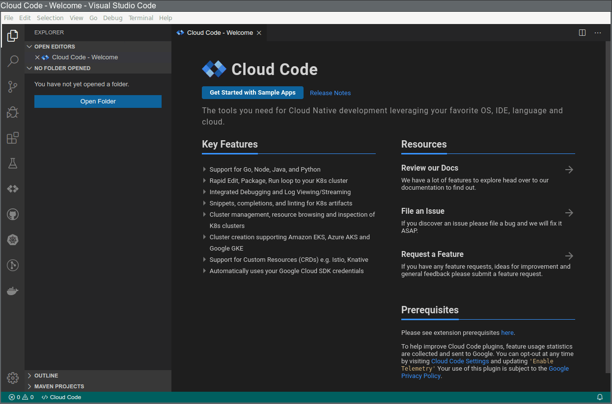

* **Cloud Code: Deploy deprecation:** ‘Cloud Code: Deploy’ and ‘Cloud Code: Continuous Deploy’ commands are [deprecated](https://cloud.google.com/code/docs/vscode/troubleshooting#how_is_the_cloud_code_run_on_kubernetes_command_different_from_cloud_code_deploy_application). While these commands continue to work, they will be removed in the next release (v1.3), targeted for the end of March.

    Use ‘Cloud Code: Run on Kubernetes’ command instead.

* **Improved Logs Viewer:** Make the most out of your log viewing with the following new filters:
  * Log Type: switch between kubectl, Cloud Logging and Cloud Run logs.
  * Cluster: switch between different clusters when viewing Cloud Logging logs. This allows you to query logs from specific clusters instead of from all of them.  For kubectl logs, this will only show the current active cluster.

    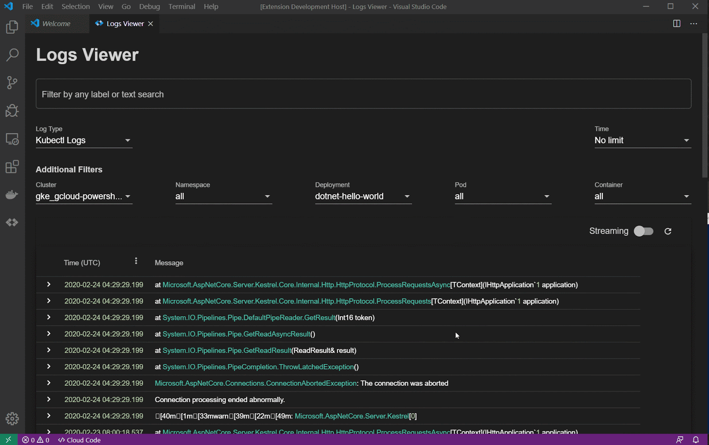

### Bug Fixes

* Cloud Code will no longer continually switch user context to the output window. [#176](https://github.com/GoogleCloudPlatform/cloud-code-vscode/issues/176)
* Fixed an issue where the Logs Viewer hangs when you don’t have permission to list all namespaces. [#201](https://github.com/GoogleCloudPlatform/cloud-code-vscode/issues/201)
* Fixed an issue where Open with Cloud Code would not clone a repository in some cases.
* Fixed an issue where Cloud Shell would fail to create an SSH configuration when the gcloud command-line tool prompted for survey participation.

## Version 1.1.2 (February 2020)

### Notable Fixes

* Fixed an issue in the "Open in Cloud Code" feature
* Fixed an issue where logs in "Cloud Code Yaml Support" output channel will grab focus
* Minor bug fixes

## Version 1.1.1 (February 2020)

### New Features

* Enable the deprecated `Cloud Code: Deploy` and `Cloud Code: Continuous Deploy` commands along side with the new and recommended command `Cloud Code: Run on Kubernetes`. You can now continue with your existing workflow while taking the time to make a switch!

### Bug Fixes

* Run in Kubernetes: Cant disable the watch (#198)

## Version 1.1.0 (January 2020)

### New Features

* **Client Library Browser:** Manage your Google Cloud APIs with Cloud Code’s freshest new feature: the Client Library Browser. View all available Google Cloud APIs, enable an API, view API status (enabled or disabled), and install client libraries to consume an API, all from within your IDE.

    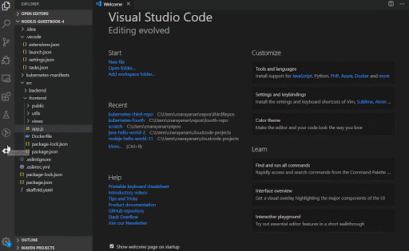

* **Cloud Code: Run on Kubernetes:**

    A new command, ‘Cloud Code: Run on Kubernetes,’ has been added that lets you run your kubernetes application and view it live. 'Cloud Code: Deploy' and 'Cloud Code: Continuous Deploy' commands have been deprecated in favor of this command. For more details on this change, please refer to this [link](https://cloud.google.com/code/docs/vscode/troubleshooting).

    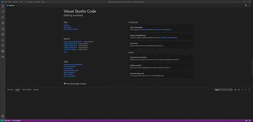

* In addition to the above features, this release also includes some bug fixes. You can view the full list [here](https://github.com/GoogleCloudPlatform/cloud-code-vscode/milestone/3).

## Version 1.0.0 (November 2019)

We are pleased to announce that Cloud Code is now GA!

### New Features

* **Cloud Shell Integration** Use the ‘Open with Cloud Code’ feature to quickly get started using Google Cloud Platform. It uses a remote development environment in [Cloud Shell](https://cloud.google.com/shell/docs) which means you’ll get to skip setup and start developing with Cloud Code with the click of a button.

    With ‘Open with Cloud Code’, you can edit, run, and debug code; as well as utilize all of Cloud Code's features directly from inside Cloud Shell. Visual Studio Code's integrated terminal allows direct interaction with command line utilities running in Cloud Shell, such as the gcloud command-line tool, skaffold, and kubectl.

    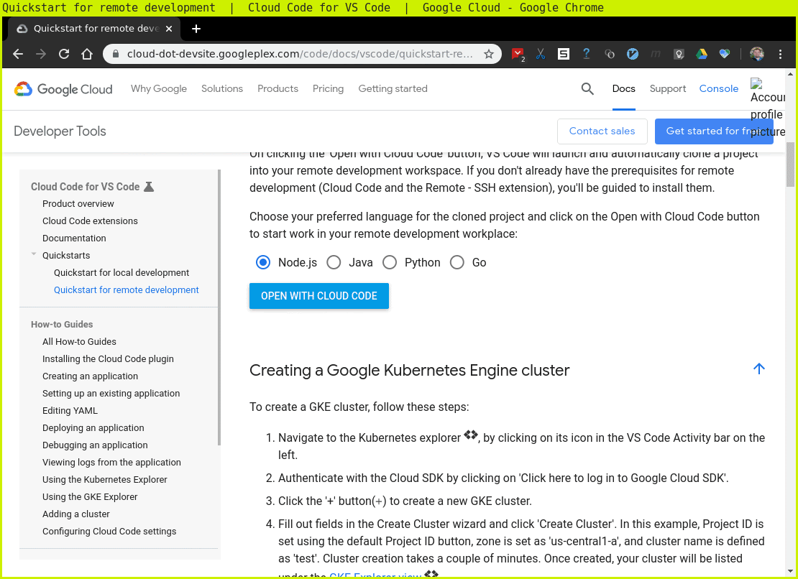

* **YAML editing** Get started with Cloud Build with Cloud Code’s built-in snippets for Cloud Build and Cloud Build trigger YAML files.

    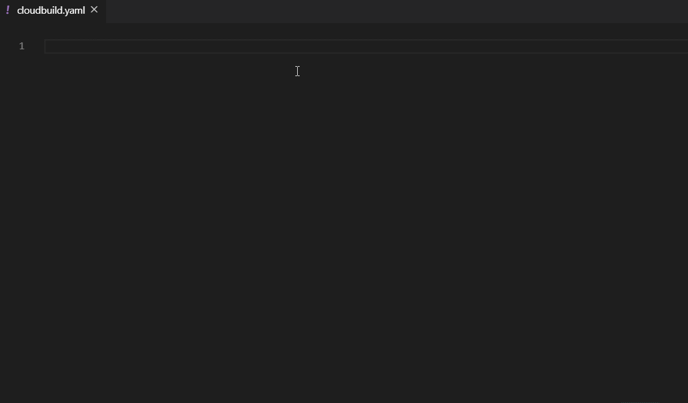

### Bug Fixes

* Added ability to view and edit yaml of Ingress resource. [#158](https://github.com/GoogleCloudPlatform/cloud-code-vscode/issues/158)

## Version 0.0.13 (November 2019)

### New Features

* **Logs Viewer**  Browse through and filter Kubernetes cluster logs easily using the new Logs Viewer. For clusters that do not support Stackdriver logging cluster logs will now be colorized.

    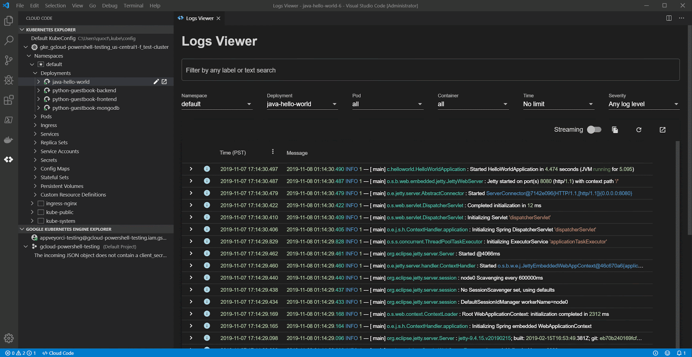

* **Dependency Installer** Cloud Code will manage kubectl and Skaffold CLI dependencies automatically.  This can be controlled using the `cloudcode.auto-install` setting.

    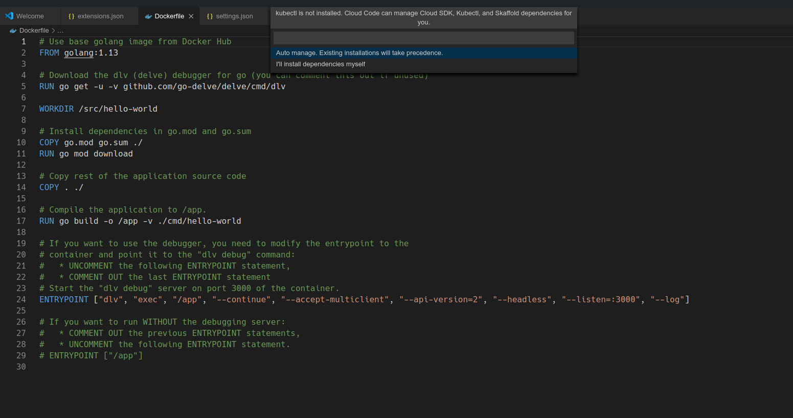

* **YAML Editing** Create and modify YAML with Cloud Code’s richer YAML editing experience for these configuration types:
  * Anthos Config Management ([link](https://cloud.google.com/anthos-config-management/docs/how-to/configs))
  * Config Connector ([link](https://cloud.google.com/config-connector/docs/overview))
  * Migrate for Anthos ([link](https://cloud.google.com/migrate/anthos/docs/yaml-reference))

    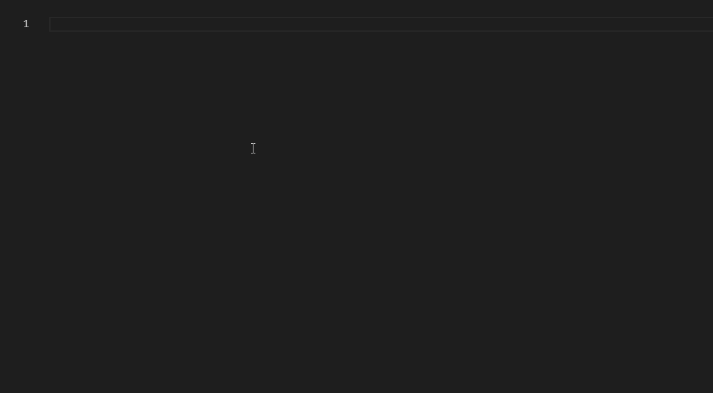

* **Colorized Streams** Deployment and Continuous Deployment output streams will be colorized to highlight key events.

    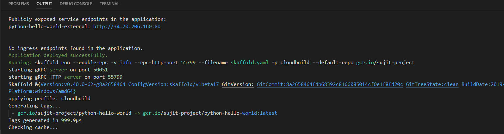

### Notable Fixes

* Improved extension activation time by removing dependency on language server activation. ([#140](https://github.com/GoogleCloudPlatform/cloud-code-vscode/issues/140))
* Reduced the memory footprint of Kubernetes Cluster Explorer to allow handling large clusters.
* Included various stability fixes. ([#147](https://github.com/GoogleCloudPlatform/cloud-code-vscode/issues/147)) ([#101](https://github.com/GoogleCloudPlatform/cloud-code-vscode/issues/101))
