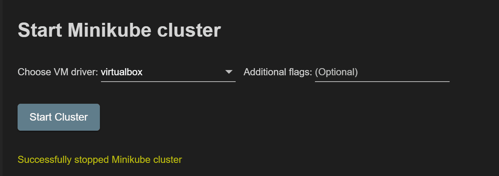
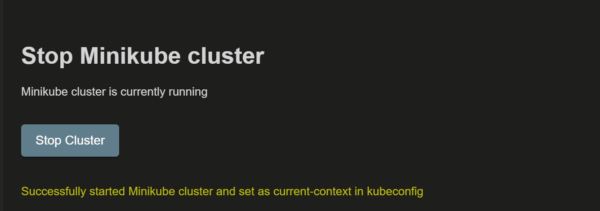
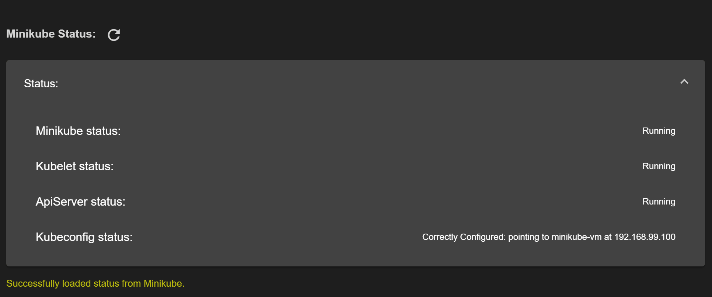

# Create a Cluster

We provide integrated support to create clusters in GKE, AWS, Azure and MiniKube.

## Google Kubernetes Engine

Creating a GKE is quick (~2-3 minutes) and easy.  You will need to provide:

* Project ID - you can search to refine the list or `project Ids`
* Zone/Region - we provide an of relevant `zone/region` options
* Configuration - the name of the `cluster` and the `agent type`

> **Tip:** You can find this command via the `pen` icon in the GKE Explorer.  

## Minikube support
You can use this wizard to start/stop and get status of a Minikube cluster. It would take ~5 minutes to bring up the local cluster.

### Prerequisites
1. All the prerequisites mentioned [here](https://kubernetes.io/docs/tasks/tools/install-minikube/#before-you-begin) are met.
2. Minikube binary is added to PATH variable or to `"cloudcode.minikubePath"` VSCode settings.

### Dashboard

### Starting minikube cluster
You need to choose the VM driver that will be used to create the Minikube cluster. The current list of supported VM drivers are:
    `['virtualbox', 'vmwarefusion', 'kvm', 'xhyve', 'hyperv', 'hyperkit', 'kvm2', 'none']`

You can pass additional flags to the `minikube start` command using the 'Additional Flags' field.

### Stopping minikube cluster

### Status of minikube cluster
