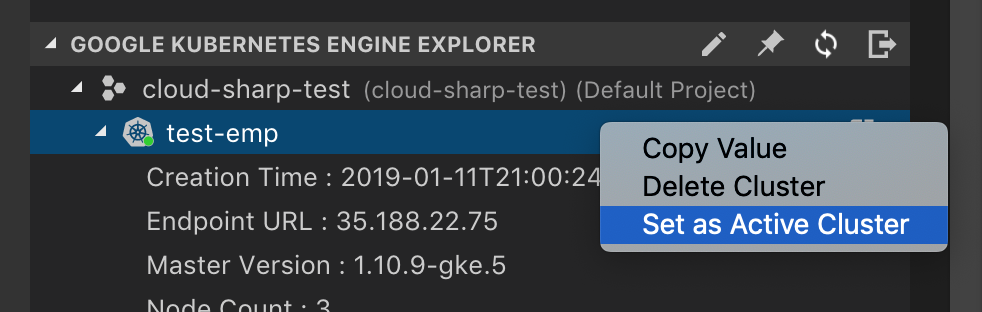

# GKE Explorer
 
The GKE explorer allows basic interactions with GKE resources and directs you to the Google Cloud Console for more advanced scenarios. 

You can view existing clusters, create new clusters and set cluster as the active cluster of kubectl.  This will enable you too easily interact with them in the Kubernetes explorer.

## Set as Active Cluster

