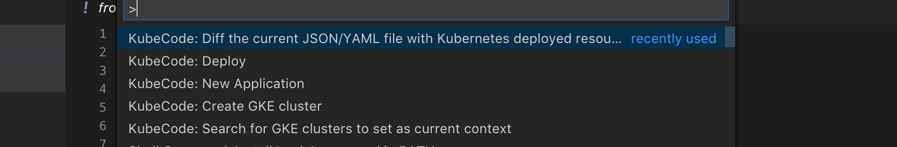
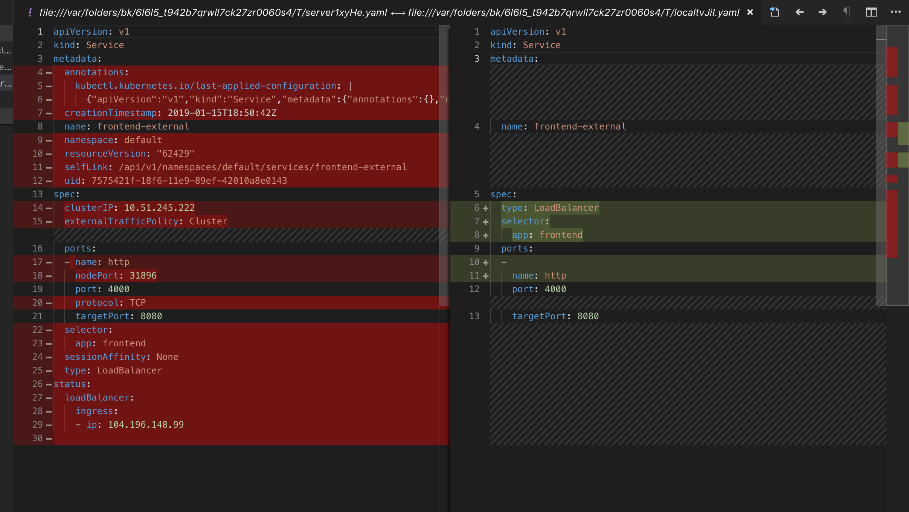

# Working with Kubernetes YAML

## YAML Validation
As you work with k8s schema we will actively lint them for both structure and valid values.  Errors are directly integrated with VS code's linting (problems) capabilities.  So for instance `F8` can be used to navigate between problems and see a description.

 

## YAML Snippets

We provide snippets out of the box for common YAML schema.  These make it easy to start a new YAML file or add to an existing one without errors (and following best practice).  They also make it easy to work with repetitive fields - type them in once and we take care of the rest.

## YAML Completions

We will provide contextual completions within a YAML file based on the current schema - we will even to provide the relevant docs to help you choose the right option.

## YAML Documentation on Hover

When you hover over a value we will sho the relevant docs from the schema.

## YAML Diffing

You can view the diff between a YAML file in source control and the deployed YAML file.

## Working with Secrets

Using config maps and secrets is a key part of working with k8s.  Our extension makes it easy to understand the contexts of a base 64 secret with a simple hover to decode.

