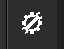
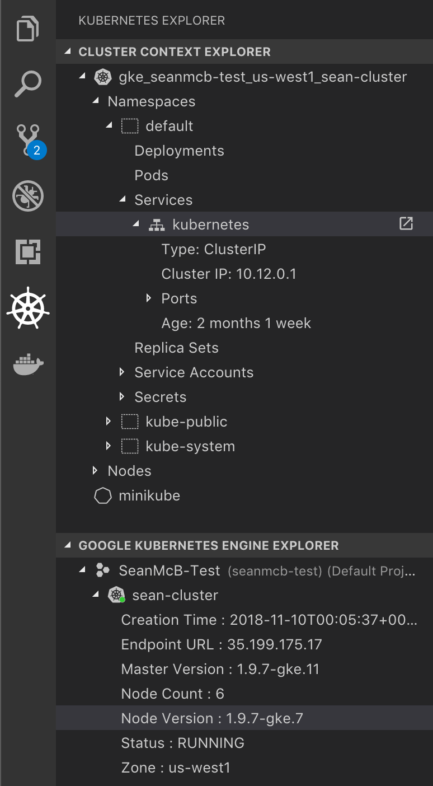
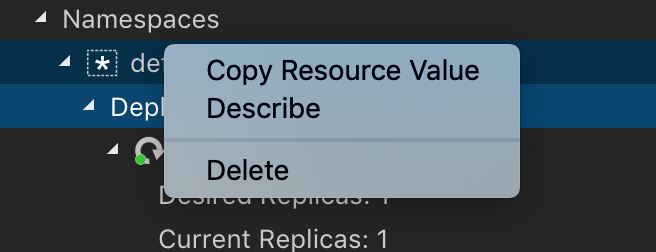
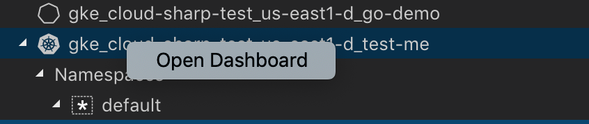
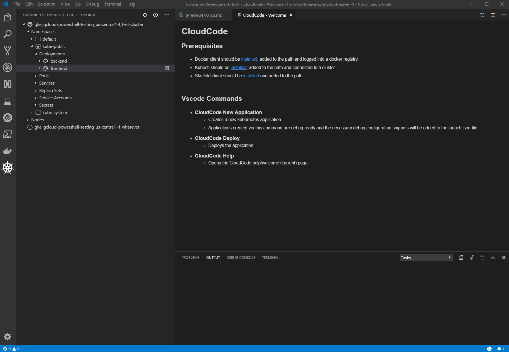
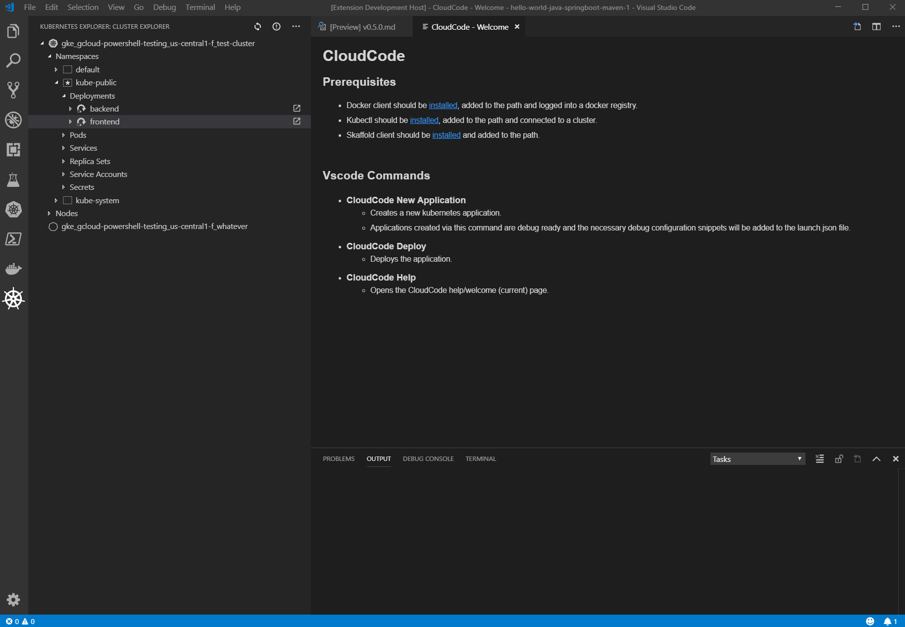
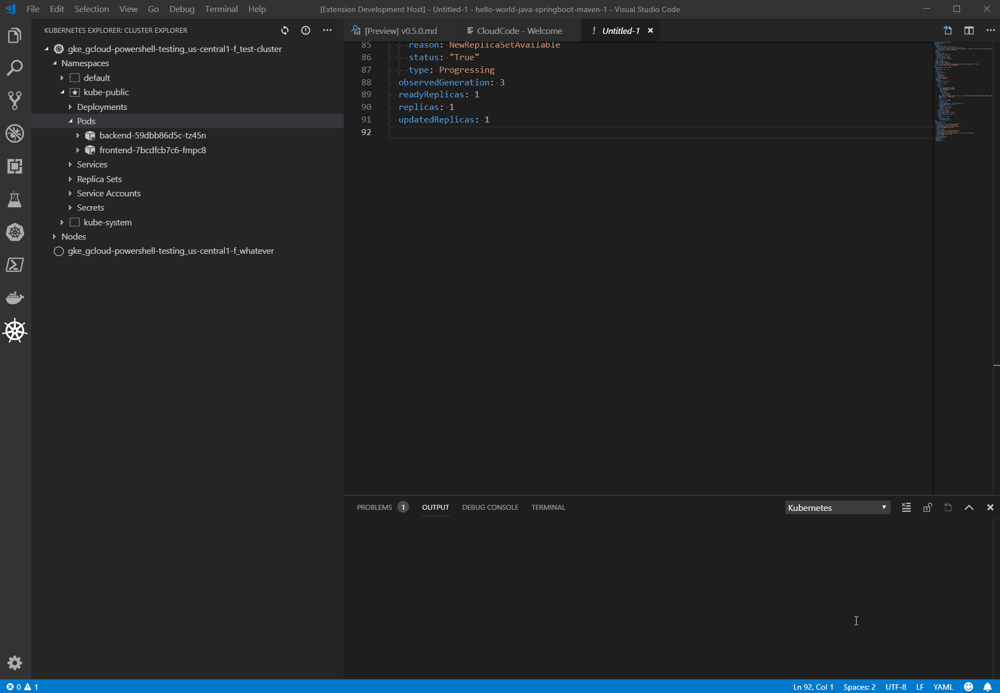
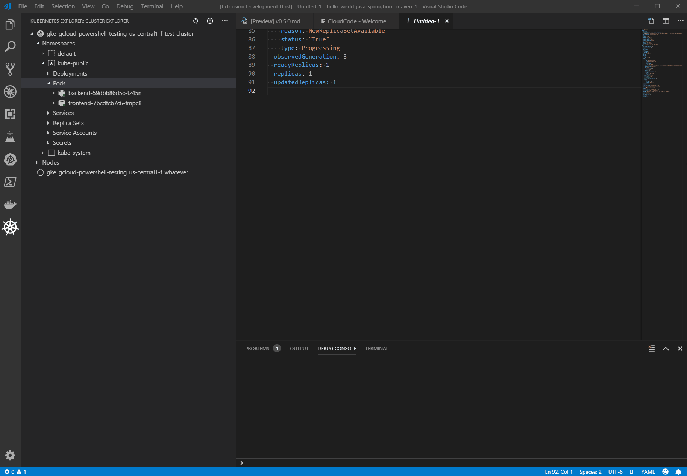
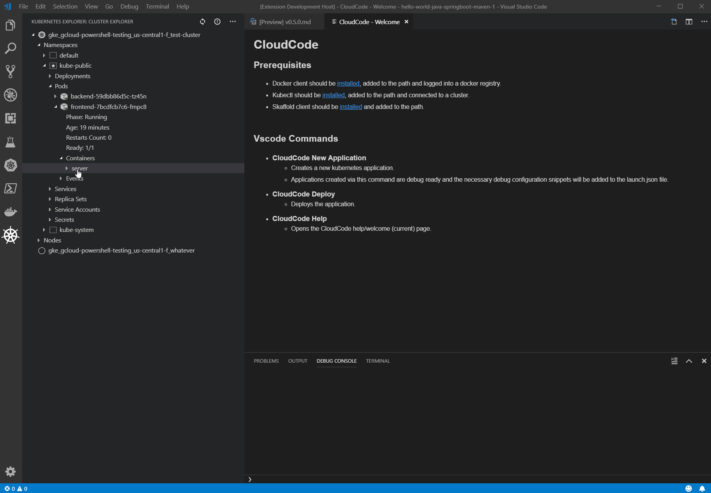
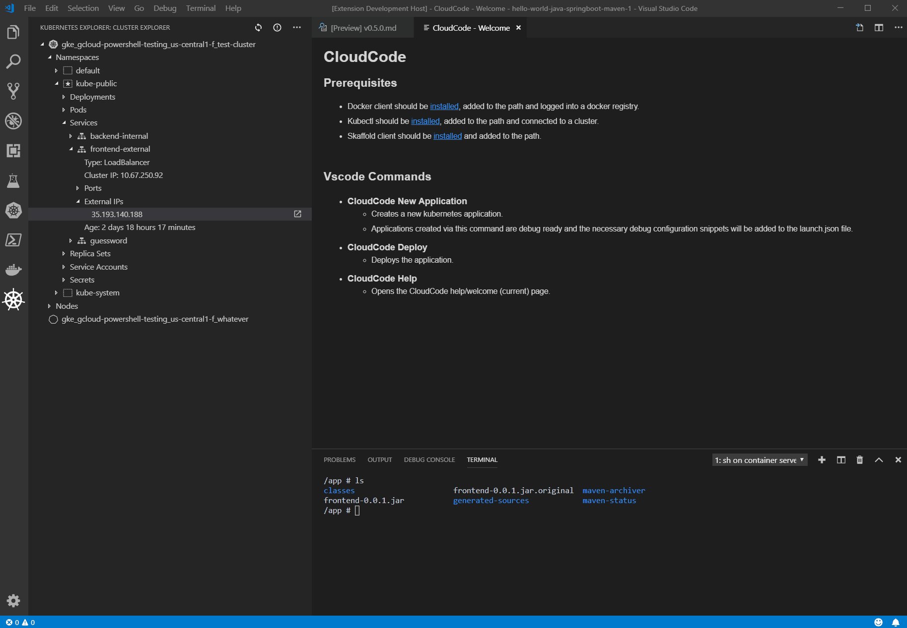

# Kubernetes Explorer

Our extension contributes an explorer to the VS Code activity bar.  This is powered by `kubectl` under the covers and will work on any supported cluster.

To navigate there click on this icon:

From here, you can access your K8s clusters and run a variety of commands, allowing you to interact with K8s resources in a unique and simple way.

Most resources have three basic functions (on top of others listed below):
- Copy Resource Name - Copy the name to the clipboard for easy use
- Describe - Do a `kubectl describe` of the resource.
- Delete - Delete the resource.

## Clusters

Set as Active Cluster - Enable you too easily interact with them in the Kubernetes explorer.

Open Dashboard - Open the kubernetes dashboard for that cluster.

## Deployments

Add Secret as Environment Variable - Add an existing Kubernetes (secret)[https://kubernetes.io/docs/concepts/configuration/secret/] to the deployment as an environment variable.

Mount Secret as Volume - Mount an existing Kubernetes (secret)[https://kubernetes.io/docs/concepts/configuration/secret/] as a volume in the deployment's container.

## Pods

Stream Logs - Stream logs from a pod. If there are multiple containers in the pod, you will be asked to select one.

View Logs - View logs from a pod. If there are multiple containers in the pod, you will be asked to select one.

## Containers

Stream Logs - Same as above

View Logs - Same as above

Get Terminal - Open an interactive terminal to the container.

## Services

For `External IP` object, you can click on a button to open the address in a web browser.

## Secrets

Clicking on secret object will display the decoded secret as a file.
